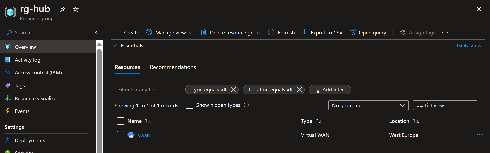
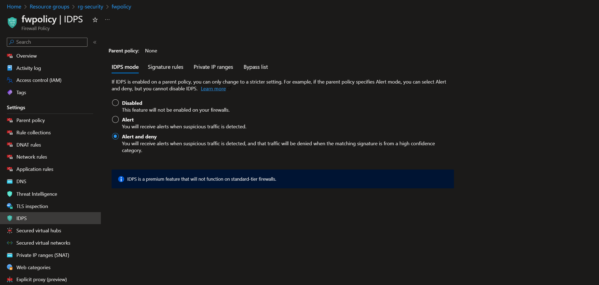

# Azure Firewall to inspect TLS traffic in an AKS environment

## Table of Contents

[Deploy an Azure Firewall to inspect TLS traffic in an AKS environment](#deploy-an-azure-firewall-to-inspect-tls-traffic-in-an-aks-environment)

[Prerequisites](#prerequisites)

[Deployment](#deployment)

[Post Deployment](#post-deployment)

[Test the Kubernetes Application](#test-the-kubernetes-application)

[Check the certificate chain](#check-the-certificate-chain)

[Exploring Azure Firewall](#exploring-azure-firewall)

[Exploring AppGw](#exploring-appgw)

[Exploring logs from the Azure Linux Virtual Machine Management](#exploring-logs-from-the-azure-linux-virtual-machine-management)

[Cleanup](#cleanup)

[Known Issues](#known-issues)

[Future Deployments](#future-deployments)

## Deploy an Azure Firewall to inspect TLS traffic in an AKS environment

The following scenario will guide you on how to deploy a "Ready to Go" environment so you can start using Azure Firewall to use TLS inpection with an AKS cluster. This escenario uses a [Hub-spoke network topology with Azure Virtual WAN](https://learn.microsoft.com/en-us/azure/architecture/networking/hub-spoke-vwan-architecture) with an Azure Firewall configured in the Virtual WAN hub, we use an AppGw with a WAF to route internet traffic to a Nginx IC installed in the AKS cluster, all the traffic will be route to the Azure Firewall.


In this scenario, AppGw and AKS cluster are in different vNets that are peered to vWAN Hub. Regarding routing, the routes that are advertised from the vWAN Default Route Table to AKS vNet are applied to the entire vNet, and not on the subnets of the AKS vNet. For this reason, UDRs are required to enable that Azure Firewall in the secure hub to inspect traffic between the AppGw and the AKS cluster. Soon, the scenario where AppGw and AKS cluster are in the same vNet will be included.

The packet flow when AppGw is in a spoke vNet is as follows:
1. A client submits a request to a web server.
2. Application Gateway examines the packets. If they pass inspection, the Application Gateway subnet forwards the packets to Azure Firewall Premium.
3. As TLS inspection is enabled in the Azure Firewall, it will verify that the HTTP Host header matches the destination IP. With that purpose, it will need name resolution for the FQDN that is specified in the Host header. Azure Firewall Premium requests DNS resolution from a Private DNS Resolver in the shared services virtual network. Note that website private zone is linked to shared services vNet, the Private DNS Resolver inbound endpoint answers the resolution request to the Nginx Ingress Controller IP address. Azure Firewall Premium runs security checks on the packets. If they pass the tests, Azure Firewall Premium forwards the packets to the Nginx Ingress Controller IP address.

    > Note that we are using an application rule to perform TLS inspection. If we were using a network rule, the packets would be forwarded to the Nginx Ingress Controller IP address without TLS inspection, so Azure Firewall would only see encrypted traffic going to the AKS cluster. As we are using an application rule, Azure Firewall will SNAT traffic by default, so the Nginx Ingress Controller will see the source IP address of the specific firewall instance that processed the packet.

  Azure Firewall Premium establishes a TLS session with the AKS application and verifies that a well-known CA signs the website TLS packets.

4. The AKS application replies to the SNAT source IP address of the Azure Firewall instance. 
5. Azure Firewall forwards the traffic to the AppGw instance.
6. Finally, AppGw instance responds to the client.


### Prerequisites

- Clone the GitHub repository

    ```shell
    git clone https://github.com/mlrcloud/vwan-azfw-aks-agic-tlsinspect.git
    ```

- [Install or update Azure CLI to version 2.42.0 and above](https://docs.microsoft.com/cli/azure/install-azure-cli?view=azure-cli-latest). Use the below command to check your current installed version.

  ```Bash
  az --version
  ```

- Create Azure service principal (SP). To deploy this scenario, an Azure service principal assigned with the following Role-based access control (RBAC) is required:

  - "Owner" - Required for provisioning Azure resources and creating needed role assignments.

    To create it login to your Azure account run the below command (this can also be done in [Azure Cloud Shell](https://shell.azure.com/)).

    Bash:
    ```Bash
    az login
    subscriptionId=$(az account show --query id --output tsv)
    az ad sp create-for-rbac -n "<Unique SP Name>" --role "Owner" --scopes /subscriptions/$subscriptionId
    ```

    PowerShell:
    ```Bash
    az login
    $subscriptionId = $(az account show --query id --output tsv)
    az ad sp create-for-rbac -n "<Unique SP Name>" --role "Owner" --scopes /subscriptions/$subscriptionId
    ```

    For example:

    Bash:

    ```Bash
    az login
    subscriptionId=$(az account show --query id --output tsv)
    az ad sp create-for-rbac -n "firewallTLSInspection" --role "Owner" --scopes /subscriptions/$subscriptionId
    ```

    PowerShell:

    ```Bash
    az login
    $subscriptionId = $(az account show --query id --output tsv)
    az ad sp create-for-rbac -n "<Unique SP Name>" --role "Owner" --scopes /subscriptions/$subscriptionId
    ```

    Output should look like this:

    ```json
    {
    "appId": "XXXXXXXXXXXXXXXXXXXXXXXXXXXX",
    "displayName": "firewallTLSInspection",
    "password": "XXXXXXXXXXXXXXXXXXXXXXXXXXXX",
    "tenant": "XXXXXXXXXXXXXXXXXXXXXXXXXXXX"
    }
    ```

  - You will also need the Service Principal Object ID

    ```Bash
    az ad sp show --id "<SP appId>" --query id -o tsv
    ```

- One of the following options:

  - Your own domain or buy one from a third party (e.g. GoDaddy).

  - [Buy a domain name by using App Service domains with an annual fee](https://learn.microsoft.com/en-us/azure/app-service/manage-custom-dns-buy-domain).

- CA Signed Certificate (certificate that has been issued and signed by a publicly trusted certificate authority (CA)). You will use these certificate for the AppGw listener and Kubernetes application replicas, if you don't have one you can use [Let's Encrypt](https://letsencrypt.org/) to create it, you will only need the PFX.

    > **NOTE: Don't forget the password used to create the PFX certificate. It will be needed later.**

- Create the Azure Firewall certificates (Root CA and Intermediate CA, you will only need the PFX): You just need to follow the instructions [here](https://learn.microsoft.com/en-us/azure/firewall/premium-certificates#create-your-own-self-signed-ca-certificate).

    > **NOTE: Don't forget the password used to create the PFX certificates. It will be needed later.**

- In this scenario we use Azure Firewall Structured Logs. By default, the new resource specific tables are disabled. You need to run the following Azure PowerShell commands to enable Azure Firewall Structured Logs:

  ```PowerShell
  Connect-AzAccount
  Select-AzSubscription -Subscription "subscription_id or subscription_name"
  Register-AzProviderFeature -FeatureName "AFWEnableStructuredLogs" -ProviderNamespace "Microsoft.Network"
  Register-AzResourceProvider -ProviderNamespace "Microsoft.Network"
  ```
    > **NOTE: Wait until the Feature is in Registered status.**

### Deployment

- The Azure Bicep deployment is using the following parameters:

  - The parameters defined in the [parameters.json](https://github.com/mlrcloud/vwan-azfw-aks-agic-tlsinspect/blob/main/agwAksDiffVnets/parameters.json) file. You just need to copy your correct values in each parameter:

    - _`spnObjectId`_ - Your Azure service principal object id.
    - _`spnClientId`_ - Your Azure service principal id.
    - _`location`_ - Azure Region where all the resources will be created.
    - _`websitePrivateDnsZonesName`_ - Your Azure Private DNS Zone Name, it must be the same name as your public domain, since this scenario is designed to use the same CA Signed Certificate in the AppGw Listener and Kubernetes application so the CN must be the same for public and private domain. Don't worry about the record (e.g. www), it will be created using ExternalDNS, you just need to set the Azure Private DNS zone name (e.g. manuelpablo.com).
    - _`websiteDomain`_ - Your public domain, e.g. www.manuelpablo.com (including the record).
    - _`fqdnBackendPool`_ - Your AppGw FQDN Backend Pool, it must be the name of your public domain, e.g. www.manuelpablo.com.

  - The secure string parameters (they will be requested when you deploy the Azure Bicep template):

    - _`spnClientSecret`_ - Your Azure service principal secret
    - _`vmMngmntAdminPassword`_ - Azure Linux Virtual Machine Management Password. Password must have 3 of the following: 1 lower case character, 1 upper case character, 1 number, and 1 special character. The value must be between 12 and 123 characters long.
    - _`fwInterCACertificateValue`_ - Azure Firewall Intermediate Certificate in Base64.
    - _`fwInterCACertificatePassword`_ - Password used to create the PFX Azure Firewall Intermediate Certificate.
    - _`fwRootCACertificateValue`_ - Azure Firewall Root Certificate in Base64.
    - _`fwRootCACertificatePassword`_ - Password used to create the PFX Azure Firewall Root Certificate.  
    - _`websiteCertificateValue`_ - Website Certificate (AppGW Listener and K8s Application) in Base64.
    - _`websiteCertificatePassword`_ - Password used to create the PFX Website Certificate.

  - Before deploy the Azure Bicep templates we need to change our certificates to Base64, you just need to use the following steps in a PowerShell terminal:

    - Move to the certificates folder:

      ```PowerShell
      cd ToYourCertificatesFolder
      ```
    - Convert the certificates to Base64 (run the following script, you just need to set the certificates filename variables)(use PowerShell 6.0 or higher):   

      ```PowerShell
      $rootCAPfxName="<Azure Firewall Root Certificate File Name>"
      $interCAPfxName="<Azure Firewall Intermediate Certificate File Name>"
      $websitecertPfxName="<Website Certificate File Name>"

      $fileContentBytes = get-content $rootCAPfxName -AsByteStream
      $rootCAbase64 = [System.Convert]::ToBase64String($fileContentBytes)

      $fileContentBytes = get-content $interCAPfxName -AsByteStream
      $interCAbase64 = [System.Convert]::ToBase64String($fileContentBytes)

      $fileContentBytes = get-content $websitecertPfxName -AsByteStream
      $websitecertCAbase64 = [System.Convert]::ToBase64String($fileContentBytes)

      Write-Host ""
      Write-Host "================"
      Write-Host "Base64 fwRootCACertificateValue"
      Write-Host $rootCAbase64
      Write-Host "================"
      Write-Host "Base64 fwInterCACertificateValue"
      Write-Host $interCAbase64
      Write-Host "================"
      Write-Host "Base64 websiteCertificateValue"
      Write-Host $websitecertCAbase64
      Write-Host "================"
      Write-Host ""
      ```
      > **NOTE: We recommend you to copy all the certificates content in a TXT file, because they will be requested in the Azure Bicep deployement.**

- Move to the local repository folder:

  ```PowerShell
  cd ToLocalRepositoryFolder
  ```

- To deploy the Bicep template, choose one of the following scripts:

  - [Azure ClI in PowerShell Terminal](https://github.com/mlrcloud/vwan-azfw-aks-agic-tlsinspect/blob/main/deploy.CLI.ps1)
  - [Azure PowerShell](https://github.com/mlrcloud/vwan-azfw-aks-agic-tlsinspect/blob/main/deploy.PowerShell.ps1)
  - [Azure ClI in Bash](https://github.com/mlrcloud/vwan-azfw-aks-agic-tlsinspect/blob/main/deploy.CLI.sh)

    > **NOTE: The deployment time for this scenario can take ~50-60min**

- In the following example we are using Azure CLI in Bash (before execute the deployment script don't forget to replace the your correct values in the [parameters.json](https://github.com/mlrcloud/vwan-azfw-aks-agic-tlsinspect/blob/main/agwAksDiffVnets/parameters.json) file):

  ```Bash
  chmod +x deploy.CLI.sh
  ./deploy.CLI.sh
  ```

- After running the deployment script, it will request the secure string parameters, just copy and paste them one by one:

    

- Once Azure resources has been provisioned, you will be able to see all these resources in the resource groups in Azure portal.

    

    

    

    

    

    

    

    

### Post Deployment

- Once the Bicep deployment is completed you must to SSH to Azure Linux Virtual Machine Management and run the [_install.sh_](https://github.com/mlrcloud/vwan-azfw-aks-agic-tlsinspect/blob/main/artifacts/install.sh) Bash script, it will create all the needed Kubernetes resources. This script will do the following actions:

  - Install all the required packages: Azure CLI, Kubectl, Helm and envsubst.
  - Disable public access in Azure Key Vault, as it had to be enabled in the Bicep deployment because the certificates are imported by an Azure Powershell Deployment script.
  - Install Nginx Ingress Controller Internal Load Balancer type.
  - Install External DNS, used to create the record A in the Azure Private DNS zone.
  - Configure workload identity to be used with Azure Key Vault Provider for Secrets Store CSI Driver.
  - Create the Kubernetes application.
  - Create the ingress to access the Kubernetes application.
  - Restart Application Gateway.

- Acces to the Azure Linux Virtual Machine Management by SSH trough the Azure firewall.

  - Retrive the Azure Firewall Public IP
  
    ```Bash
    FIREWALL_PUBLIC_IP=$(az network firewall show  --name azfw --resource-group rg-security --query hubIpAddresses.publicIPs.addresses[0].address -o tsv)
    ```

  - Connect to Azure Linux Virtual Machine Management

    ```Bash
    ssh azureadmin@$FIREWALL_PUBLIC_IP
    ````

- Run _install.sh_ script

  ```Bash
  ./install.sh
  ```
  Let the script to run its course...

    

    

    

    

    

    

    

    

    

    

### Test the Kubernetes Application

- Create a record A to point your domain to the AppGw Public IP, to retrieve the Public IP you can use the following az CLI command

```Bash
az network public-ip show -g rg-agw -n agw-pip --query ipAddress -o tsv
```

- Open a web browser and type your domain


### Check the certificate chain

To view the certificates chain, lets create an Azure Linux VM in a subnet in the AppGw Vnet, to simulate the AppGw request

- Create a new subnet in the same Vnet as AppGw

  ```Bash
  az network vnet subnet create -g rg-agw --vnet-name vnet-agw -n myVmTest --address-prefixes 10.0.5.0/24
  ```

- Create the Azure Linux VM test

  ```Bash
  az vm create \
    --resource-group rg-agw \
    --name myVmTest \
    --image Ubuntu2204 \
    --admin-username azureadmintest \
    --admin-password 'Pa$$word123!' \
    --public-ip-address "" \
    --vnet-name vnet-agw \
    --subnet myVmTest \
    --private-ip-address 10.0.5.4
  ```

- Retrive the Azure Firewall Public IP

  ```Bash
  FIREWALL_PUBLIC_IP=$(az network firewall show  --name azfw --resource-group rg-security --query hubIpAddresses.publicIPs.addresses[0].address -o tsv)
  ```

- Create a new DNAT rule in Azure Firewall Policy to access by SSH to this test VM

  ```Bash
  az network firewall policy rule-collection-group collection rule add \
    --policy-name fwpolicy \
    --collection-name RemoteAccessRuleCollection \
    --rule-collection-group-name fwdnatrulegroup \
    --rule-type NatRule \
    --resource-group rg-security \
    --name dns-ssh-access-vm-test \
    --source-addresses '*' \
    --destination-ports 2222 \
    --ip-protocols TCP \
    --dest-addr $FIREWALL_PUBLIC_IP \
    --translated-address 10.0.5.4 \
    --translated-port 22
  ```
- Create a new App rule in Azure Firewall Policy to access the Kubernetes application from the Azure Linux VM test

  ```Bash
  az network firewall policy rule-collection-group collection rule add \
    --policy-name fwpolicy \
    --collection-name AksFwWeRuleCollection \
    --rule-collection-group-name fwapprulegroup \
    --rule-type ApplicationRule \
    --resource-group rg-security \
    --name fromVmTestToIngressController \
    --source-addresses '10.0.5.0/24' \
    --protocols Https \
    --enable-tls-inspection true \
    --target-fqdns <YOUR DOMAIN>
  ```

  Example:

  ```Bash
  az network firewall policy rule-collection-group collection rule add \
    --policy-name fwpolicy \
    --collection-name AksFwWeRuleCollection \
    --rule-collection-group-name fwapprulegroup \
    --rule-type ApplicationRule \
    --resource-group rg-security \
    --name fromVmTestToIngressController \
    --source-addresses '10.0.5.0/24' \
    --protocols Https=443 \
    --enable-tls-inspection true \
    --target-fqdns www.manuelpablo.com
  ``` 

- Connect to Azure Linux Management VM

  ```Bash
  ssh azureadmintest@$FIREWALL_PUBLIC_IP -p 2222
  ````

- Updaload the rootCA.crt Azure Firewall certificate to the Azure Linux VM test (you can just create a new file with the rootCA.crt content)

- Use OpenSSL to verify the certificate

  ```Bash
  openssl s_client -connect <Ingress Controller Private IP>:443 -servername <Your Domain> -CAfile <rootCA.crt file> -showcerts
  ```

  Example:

  ```Bash
  openssl s_client -connect 10.0.2.73:443 -servername www.manuelpablo.com -CAfile rootCA.crt -showcerts
  ```

  As you can see the Azure Firewall generates a new server certificate signed by a private CA (Certificate Authority).

  

### Exploring Azure Firewall

- Go to Azure Portal > rg-security > azfw

  

  

Azure Firewall Premium receives the traffic and inspects it for threats. Azure Firewall Premium has TLS inspection capabilities that decrypts the traffic, applies IDPS (Intrusion Detection and Prevention) inspection and re encrypts the traffic to forward to the web application. Azure Firewall Premium uses a private CA (Certificate Authority) which signs the dynamically generated certificates.
To understand the potentital of Azure Firewall TLS inspection just click on this [link](https://learn.microsoft.com/en-us/azure/firewall/premium-features#tls-inspection), for IDPS use this [link](https://learn.microsoft.com/en-us/azure/firewall/premium-features#idps).

- Test IDPS (this curl sends HTTPS traffic to the web application using a known malicious user agent)

  ```Bash
  curl --ssl-no-revoke -A "HaxerMen" https://<YOUR DOMAIN>
  ```

  Example:

  ```Bash
  curl --ssl-no-revoke -A "HaxerMen" https://www.manuelpablo.com
  ```

  As you can see it gives a timeout

  

  Go to Azure Firewall Log and run the following KQL

  ```Bash
  AZFWIdpsSignature
  | take 100
  ```

  

  As you can see two Azure Firewall IDPS signatures has been triggered

### Exploring AppGw

- Go to Azure Portal > rg-agw > agw > Health probes

  

  As you can see we have a AppGw Custom Probe, AppGw Default Probe doesn't work because it won't be used as [SNI header](https://en.wikipedia.org/wiki/Server_Name_Indication). If a Custom Probe isn't configured, then Application Gateway sends a Default Probe in this format - protocol://127.0.0.1:port/. For example, for a default HTTPS probe, it will be sent as https://127.0.0.1:443/.

  > **NOTE: If you don't create the custom probe you could experience this [issue](https://learn.microsoft.com/en-us/azure/application-gateway/application-gateway-backend-health-troubleshooting#backend-certificate-invalid-common-name-cn).**

- Lets test AppGW WAF

  To test the WAF policy we are going to create a custom rule to block our Public IP when we want to access the Kubernetes application.

  ```Bash
  az network application-gateway waf-policy custom-rule create \
    --action Block \
    --name waf-policy-rule \
    --policy-name waf-policy \
    --priority 10 \
    --resource-group rg-agw \
    --rule-type MatchRule
  ```

  We create the condition for my Public IP (substitute your Public IP in the variable *MY_PUBLIC_IP*).

  ```Bash
  MY_PUBLIC_IP="<MY PUBLIC IP>"

  az network application-gateway waf-policy custom-rule match-condition add \
    --resource-group rg-agw \
    --policy-name waf-policy \
    --name waf-policy-rule \
    --match-variables RemoteAddr \
    --operator Equal \
    --values $MY_PUBLIC_IP
  ```
  
  Change the WAF from detection to prevention mode

  ```Bash
  az network application-gateway waf-policy policy-setting update \
    --mode Prevention \
    --policy-name waf-policy \
    --resource-group rg-agw \
    --state Enabled
  ```

  Refres your web browser

  

  As you can see the request is blocked

### Exploring logs from the Azure Linux Virtual Machine Management

Occasionally, you may need to review log output from scripts that run on the Azure Linux Virtual Machine Management in case of deployment failures. To make troubleshooting easier, the scenario deployment scripts collect all relevant logs in the _$HOME_ directory. A short description of the logs and their purpose can be seen in the list below:

| Logfile | Description |
| ------- | ----------- |
| _$HOME/download.log_ | Output from the initial dowload script that runs on Azure Linux Virtual Machine Management. |

### Cleanup

If you want to delete the entire environment, simply delete the deployment resource groups from the terminal with Azure CLI.

  ```Bash
  az group delete -n rg-agw
  az group delete -n rg-aks
  az group delete -n rg-hub
  az group delete -n rg-mngmnt
  az group delete -n rg-monitor
  az group delete -n rg-security
  az group delete -n rg-shared
  ```

### Known Issues

- We have imported the Cetificates to Azure Key Vault using an Azure Deployment Script in the Azure Bicep deployment. Azure Bicep just can import certificates as secret objects, but we need to import the website PFX certificate as certificate object, if not Secrets Store CSI Driver will fail in the kubernetes.io/tls secret object creation. To import the Azure Firewall certificates we use the deployment script as well just for consistency, but you can import them with Azure Bicep as a secret object.
- AppGw uses custom DNS servers assigned to its VNET to resolve most of its backend servers FQDNs, but for some of them it uses the Azure built-in DNS service (168.63.129.16), ignoring custom DNS. To resolve this issue you can just link the agw Vnet to the Azure Private DNS zone or use a Forwarding Rule for the DNS Private Resolver (which is the solution we have used).
- The record type A to point our application throug the ingress is created after the AppGw resource creation, so you will to to restart AppGw, if not you will experience this [issue](https://learn.microsoft.com/en-us/azure/application-gateway/application-gateway-backend-health-troubleshooting#updates-to-the-dns-entries-of-the-backend-pool) (this is the reason why we restart AppGw in the [install.sh](https://github.com/mlrcloud/vwan-azfw-aks-agic-tlsinspect/blob/main/artifacts/install.sh) script).

### Future Deployments

- Same Vnet option deployment for AKS and AppGw
- Application Gateway Ingress Controller Limitations